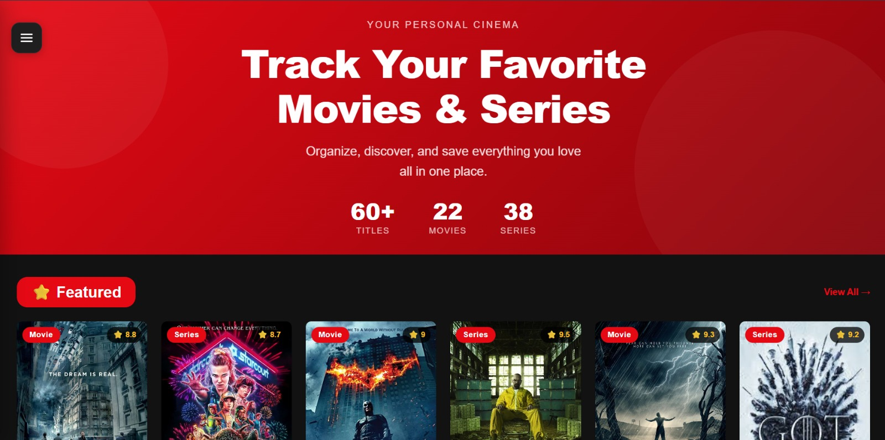
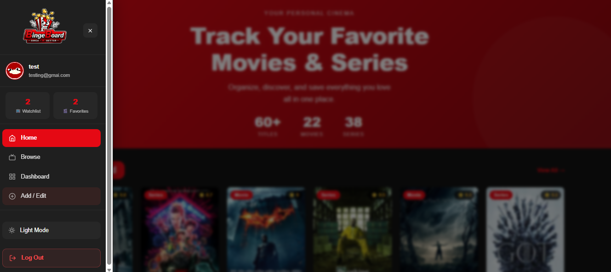
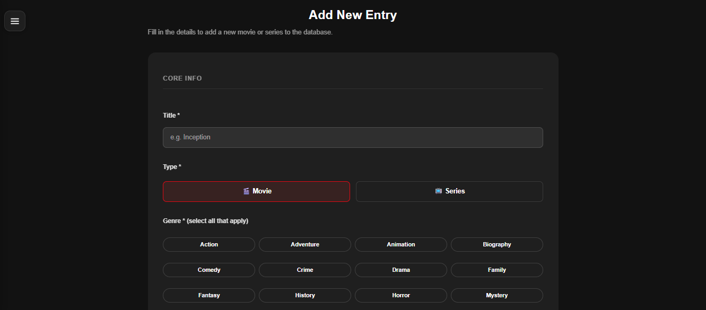
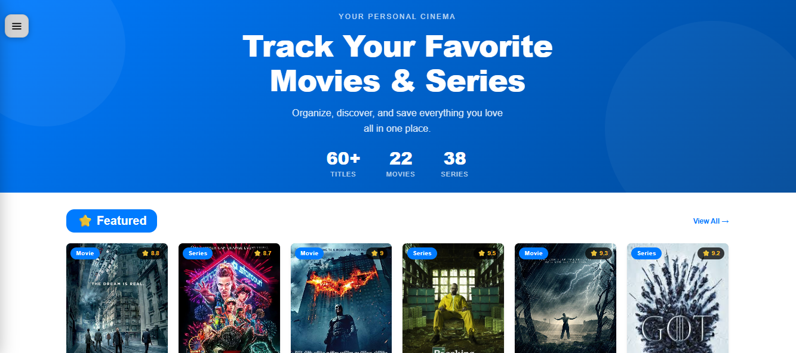
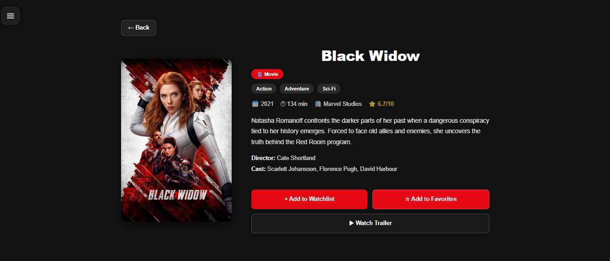
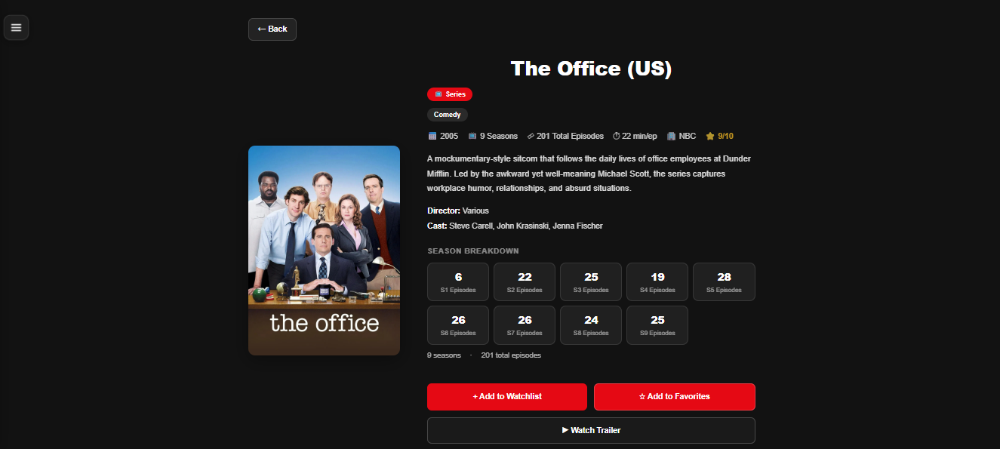
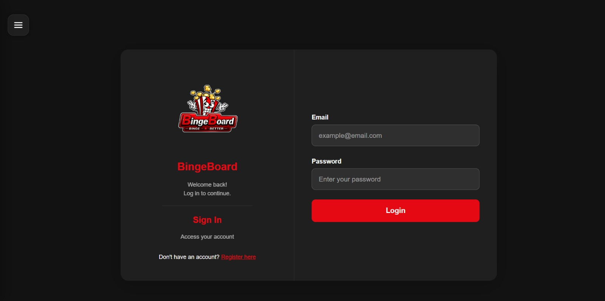
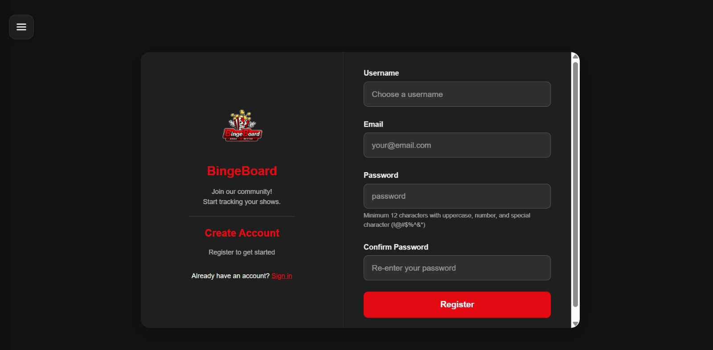
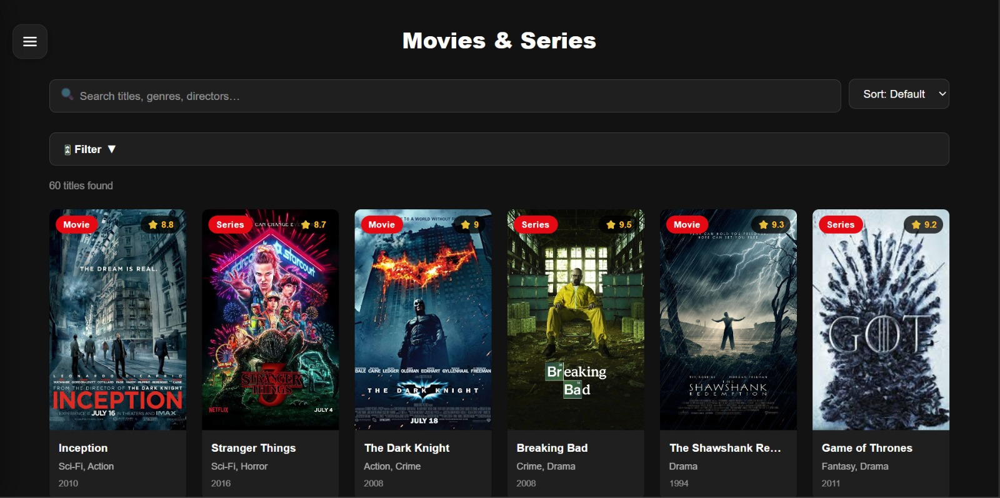

# 🎬 BingeBoard

A full-stack movie and TV show tracker — browse, search, and manage your watchlist and favorites, backed by a real REST API and MongoDB database.

---

## 👥 Team Members

| Name                  | GitHub          |
| --------------------- | --------------- |
| Leen Harfoush         | harfoushleen    |
| Hamza El Hallak       | HamzaElHallak   |
| Garen Garo Baghsarian | Garenb3         |
| Laura Malaeb          | laura1025       |

---

## 📌 Project Topic

**Movie / TV Show Tracker** — A web application where users can browse, search, and manage movies and TV shows.

### Primary Data Entities

- **Media (Movie / Series)** — Stored in MongoDB. Includes title, genre, rating, director, cast, studio, duration, trailer, description, image, featured/trending flags, and an optional `seasons` object for series.
- **User** — Stored in MongoDB. Includes username, email, hashed password, profile picture, watchlist, favorites, and recently viewed arrays.

---

## 🚀 Live Demo

> https://sunny-alpaca-ca3d90.netlify.app/

---

## ⚙️ Setup Instructions

### Prerequisites

- Node.js (v18 or higher)
- npm (comes with Node.js)
- A MongoDB Atlas account (or local MongoDB installation)

---

### 1. Clone the Repository

```bash
git clone https://github.com/Garenb3/Loading.git
cd Loading
```

---

### 2. Frontend Setup

```bash
# Install frontend dependencies
npm install

# Create a .env file in the root (same folder as vite.config.js)
```

Create a file called `.env` in the **root** of the project:

```env
VITE_API_URL=http://localhost:5000/api
```

```bash
# Start the frontend
npm run dev
```

Frontend runs on: **http://localhost:5173**

---

### 3. Backend Setup

```bash
# Navigate to the server folder
cd server

# Install backend dependencies
npm install

# Create a .env file inside /server
```

Create a file called `.env` inside the `/server` folder:

```env
MONGO_URI=mongodb+srv://<username>:<password>@cluster0.xxxxx.mongodb.net/bingeboard?retryWrites=true&w=majority
JWT_SECRET=your_secret_key_here
PORT=5000
NODE_ENV=development
CORS_ORIGIN=http://localhost:5173,http://localhost:3000
```

```bash
# Start the backend server
npm run dev
```

Backend runs on: **http://localhost:5000**

---

### 4. Seed the Database

The media data (60 movies and series) must be seeded into MongoDB before the app will display content.

```bash
# From inside the /server folder
node seed.js
```

You should see:
```
✅ Connected to MongoDB
🗑  Cleared existing media
✅ Inserted 60 media items
✅ Done — database seeded successfully
```

---

### Notes

- The `.env` files are **not committed** to GitHub for security. Each teammate must create them manually using the values above.
- MongoDB Atlas: make sure your IP address is whitelisted (or set to `0.0.0.0/0` for open access during development).
- Passwords are hashed with bcrypt — plain-text passwords are never stored.
- All protected routes (add/edit/delete media, watchlist, favorites) require a valid JWT token sent in the `Authorization: Bearer <token>` header.

---

## 🗂️ Pages & Views

| Page               | File               | Responsible Member    |
| ------------------ | ------------------ | --------------------- |
| Home               | `Home.jsx`         | Laura Malaeb          |
| Login              | `Login.jsx`        | Laura Malaeb          |
| Register           | `Register.jsx`     | Leen Harfoush         |
| Dashboard          | `Dashboard.jsx`    | Leen Harfoush         |
| Browse (List View) | `ListView.jsx`     | Garen Garo Baghsarian |
| Movie Detail       | `MovieDetail.jsx`  | Garen Garo Baghsarian |
| TV Show Detail     | `TVShowDetail.jsx` | Hamza El Hallak       |
| Add / Edit Form    | `AddEditForm.jsx`  | Hamza El Hallak       |

---

## 🧩 Team Contributions

### Leen Harfoush — `Register.jsx`, `Dashboard.jsx`

**Register Page**
- Designed a two-section registration layout for improved visual organization and user experience.
- Built complete client-side validation: email format, minimum 12-character password with uppercase, number, and special character requirements, and password confirmation matching.
- On successful registration, calls `POST /api/auth/register`, stores the JWT token and user object in localStorage, and redirects to the dashboard.
- Link to Login page for returning users.

**Dashboard Page**
- Developed the main dashboard with three fully functional sections: Watchlist, Favorites, and Recently Viewed — all fetched from `GET /api/user/:id` on mount.
- Implemented collapsible sections with smooth expand/collapse animations and a fixed profile panel that stays on screen while scrolling.
- Remove buttons call `DELETE /api/user/:id/watchlist/:mediaId` and `DELETE /api/user/:id/favorites/:mediaId` to sync changes with the database.
- Guest user restrictions — unauthenticated users are shown a login prompt when attempting to add items.
- Recently Viewed is tracked via `POST /api/user/:id/recentlyviewed` on every detail page visit.
- Error banner with retry button if the API call fails.

**Profile Component (`Profile.jsx`)**
- Fixed profile panel using `position: fixed` so it stays visible while scrolling.
- Profile picture upload with live preview, stored in localStorage.
- Username and email editing via `PUT /api/user/:id`.
- Password change via `PUT /api/auth/change-password` using bcrypt verification on the backend.
- Rate Us feature with an interactive star rating widget.
- Guest access control: prompts unauthenticated users to sign up before editing.

**Backend — Express Server & Middleware**
- Initialized the Node.js/Express server with a clean, scalable folder structure.
- Configured security middleware: Helmet (with `crossOriginResourcePolicy: cross-origin` for image serving), CORS, and rate limiting (100 requests per 15 minutes).
- Added request logging with Morgan and centralized error handling middleware.
- Configured static file serving for images via `express.static`.

---

### Hamza El Hallak — `TVShowDetail.jsx`, `AddEditForm.jsx`

**TV Show Detail Page**
- Fetches the correct show from `GET /api/media` by matching the numeric `id` from the URL.
- Displays title, description, rating (`⭐ x/10`), genres, studio, release year, director, writer, producer, cast, and a seasons grid (total seasons + episodes per season).
- Add to Watchlist / Add to Favorites toggle buttons call `POST` and `DELETE /api/user/:id/watchlist` and `/favorites` to sync with MongoDB.
- "Watch Trailer" button opens a YouTube embed in a modal overlay.
- Recently Viewed tracked via API on each visit.
- Back button using `navigate(-1)`.

**Add / Edit Form Page**
- Dynamic form supporting both creating new entries (`POST /api/media`) and editing existing ones (`PUT /api/media/:id`).
- Full client-side validation on all required fields.
- Series-specific fields: number of seasons and episodes per season (comma-separated), sent to the backend as a structured `seasons` object.
- Image input supports two modes: URL input or file upload (`POST /api/media/upload` using multer, saved to `server/public/images/`).
- Image preview resolves correctly whether the image is a full URL or a server-hosted filename.
- "My Submissions" section lists all media created by the logged-in user with Edit and Delete buttons.
- Auth guard redirects unauthenticated users to login.

**JWT & Authentication Middleware**
- Implemented `authMiddleware.js` to verify JWT tokens on protected routes.
- Token decoded to extract `userId` and attach it to the request object.
- Returns `401 Unauthorized` for missing or expired tokens.

**Protected Routes & Authorization**
- All create, update, and delete media routes require a valid JWT.
- `changePassword` endpoint verifies the current password with bcrypt before updating.

---

### Garen Garo Baghsarian — `ListView.jsx`, `MovieDetail.jsx`

**Browse / List View Page**
- Fetches all media from `GET /api/media` on mount with a loading state and retry button on error.
- Responsive grid using `auto-fill` with `minmax(160px, 1fr)`.
- Search bar matches query words against title, genre, and director (partial substring matching).
- Filter panel with Type (All / Movies / Series) and Genre filters, active filter count badge, and "Clear all filters" button.
- Sort options: Default, Rating ↓/↑, Newest/Oldest, Title A–Z.
- Live result count and empty state UI.

**Movie Detail Page**
- Fetches all media from `GET /api/media` and finds the item by numeric `id` from the URL.
- Displays title, genres, release year, duration, studio, rating, description, director, writer, producer, and cast.
- Add to Watchlist / Add to Favorites toggle via `POST` and `DELETE /api/user/:id/watchlist` and `/favorites`.
- Syncs button state on mount by reading `GET /api/user/:id` to check existing watchlist/favorites.
- Guest restriction with a login prompt modal.
- "Watch Trailer" modal with YouTube embed and autoplay.
- Action error banner and loading state on buttons.
- Recently Viewed tracked via `POST /api/user/:id/recentlyviewed`.
- Back button using `navigate(-1)`.

**Full-Stack Integration**
- Built `src/utils/authService.js` with `registerUser`, `loginUser`, `logoutUser`, `authFetch` (authenticated fetch wrapper), `getAuthToken`, `getUser`, and `isAuthenticated` utilities.
- `authFetch` automatically attaches the Bearer token and redirects to `/login` on 401 responses.
- Replaced all `Data.js` imports across the app with live API calls.
- Coordinated `.env` setup across frontend and backend for all team members.
- Seeded the MongoDB database using `server/seed.js`.

---

### Laura Malaeb — `Home.jsx`, `Login.jsx`

**Home Page**
- Fetches all media from `GET /api/media` on mount to display live Featured and Trending sections.
- Stats row (total titles, movies, series) reflects live counts from the database.
- "Show More / Show Less" toggle with smooth state transitions and scroll-to-section behavior.
- "Browse All" and "Join Free" CTA buttons.
- "View All →" links next to section headings.
- Loading state while fetching and error banner with retry button.

**Login Page**
- Two-panel layout (branding + form) consistent with the Register page.
- Calls `POST /api/auth/login` via `loginUser` from `authService.js`.
- Stores JWT token and user object in localStorage on success.
- Redirects to the dashboard after successful login.
- Error feedback on invalid credentials.
- Link to Register page for new users.

**Sidebar Component (`Sidebar.jsx`)**
- Fixed hamburger button that opens a slide-in drawer.
- Displays username, email, and live watchlist/favorites counts fetched from `GET /api/user/:id`.
- Counts refresh on every route change to stay in sync after add/remove actions.
- Theme toggle (dark/light mode) and logout button that clears localStorage and redirects to login.
- Active route highlighting and outside-click close behavior.

**Movie Card Component (`MovieCard.jsx`)**
- Reusable card for movies and series with dynamic routing (`/movie/:id` or `/tv/:id`).
- Resolves image src: uses full URL directly if it starts with `http`, otherwise prepends `${BASE_URL}/images/` for server-hosted images.
- Type badge, rating badge, fallback image on error, and hover scale effect.

**Database Design & Setup**
- Designed the `User` schema (username, email, hashed password, profilePicture, watchlist, favorites, recentlyViewed as String arrays).
- Designed the `Media` schema (id, title, type, genre, featured, trending, image, duration, releaseDate, rating, director, writer, producer, studio, cast, description, trailer, seasons, createdBy).
- Connected the backend to MongoDB Atlas.
- Full CRUD operations implemented for both Users and Media via Mongoose.

---

## 🗃️ Data & API

### Media Data

60 movies and series are seeded into MongoDB from `src/data/Data.js` using `server/seed.js`. Each document contains:

```js
{
  id: 1,                          // numeric ID used for frontend routing
  title: "Inception",
  type: "movie",                  // "movie" | "series"
  genre: ["Sci-Fi", "Action", "Thriller"],
  featured: true,
  trending: true,
  image: "Inception.jpg",         // filename served from server/public/images/
  duration: 148,
  releaseDate: "2010",
  rating: 8.8,
  director: "Christopher Nolan",
  studio: "Warner Bros.",
  cast: ["Leonardo DiCaprio", "Joseph Gordon-Levitt"],
  description: "...",
  trailer: "https://www.youtube.com/embed/YoHD9XEInc0"
}
```

Series additionally include:
```js
seasons: {
  total: 4,
  episodesPerSeason: [8, 9, 8, 9]
}
```

### API Endpoints

| Method | Endpoint | Auth | Description |
|--------|----------|------|-------------|
| POST | `/api/auth/register` | — | Register a new user |
| POST | `/api/auth/login` | — | Login and receive JWT |
| PUT | `/api/auth/change-password` | ✅ | Change password (bcrypt verified) |
| GET | `/api/media` | — | Get all media |
| GET | `/api/media/:id` | — | Get single media item |
| POST | `/api/media` | ✅ | Create new media entry |
| PUT | `/api/media/:id` | ✅ | Update media entry |
| DELETE | `/api/media/:id` | ✅ | Delete media entry |
| POST | `/api/media/upload` | ✅ | Upload image file |
| GET | `/api/user/:id` | — | Get user data |
| PUT | `/api/user/:id` | ✅ | Update user profile |
| DELETE | `/api/user/:id` | ✅ | Delete user |
| POST | `/api/user/:id/watchlist` | ✅ | Add to watchlist |
| DELETE | `/api/user/:id/watchlist/:mediaId` | ✅ | Remove from watchlist |
| POST | `/api/user/:id/favorites` | ✅ | Add to favorites |
| DELETE | `/api/user/:id/favorites/:mediaId` | ✅ | Remove from favorites |
| POST | `/api/user/:id/recentlyviewed` | ✅ | Track recently viewed |

---

## 🖼️ Screenshots

| Feature             | Preview                              |
| ------------------- | ------------------------------------ |
| Home Page           |            |
| Sidebar             |       |
| Add / Edit          |  |
| Dashboard           |   |
| Filter Panel        |         |
| Light Mode          |       |
| Movies              |          |
| TV Shows            |         |
| User Login          |          |
| Sign Up             |         |
| Watch Trailer       |  |
| List View           |   |

---

## 🛠️ Tech Stack

| Technology    | Usage                                                            |
| ------------- | ---------------------------------------------------------------- |
| React (Vite)  | Component-based UI, hooks (`useState`, `useEffect`, `useMemo`, `useCallback`) |
| React Router  | Client-side navigation, route parameters                         |
| Tailwind CSS  | Responsive utility-first styling                                 |
| JavaScript (ES6+) | Application logic                                            |
| Node.js       | Backend runtime environment                                      |
| Express.js    | RESTful API development and server-side logic                    |
| MongoDB Atlas | Cloud database for persistent data storage                       |
| Mongoose      | MongoDB ODM — schema definition and querying                     |
| JWT           | Secure authentication and session management                     |
| bcrypt        | Password hashing and verification                                |
| Multer        | Image file upload handling                                       |
| Helmet        | HTTP security headers                                            |
| Morgan        | Request logging                                                  |
| express-rate-limit | API rate limiting                                           |
| localStorage  | Client-side storage for auth token, user info, and theme         |
| Vercel        | Frontend deployment                                              |
| Render        | Backend deployment                                               |
| Git & GitHub  | Version control and collaboration                                |
