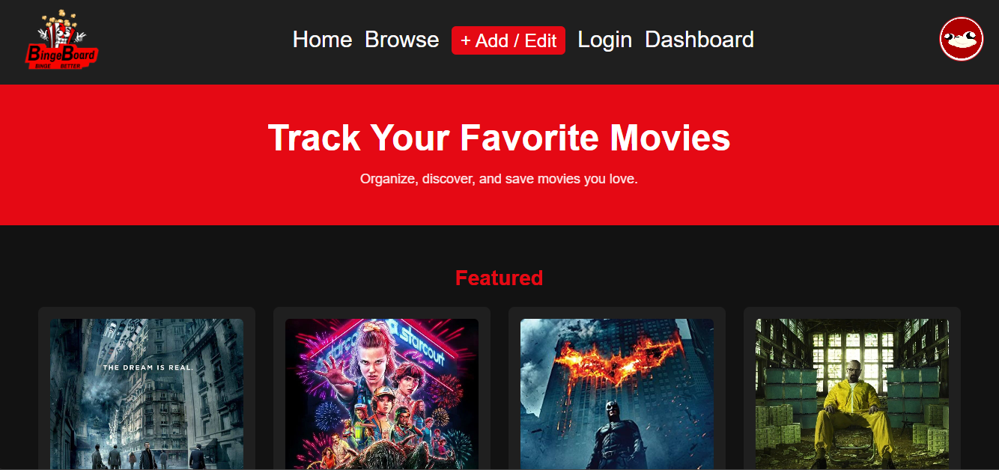
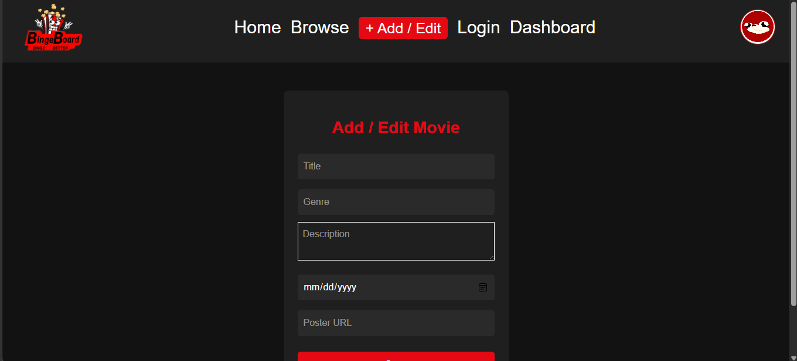
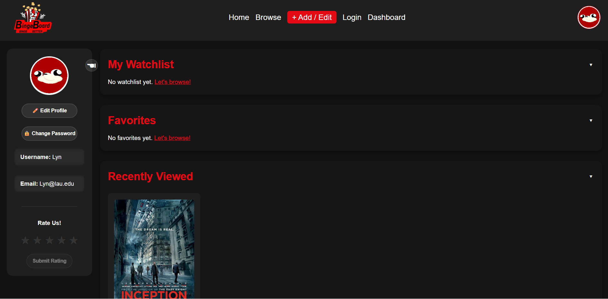
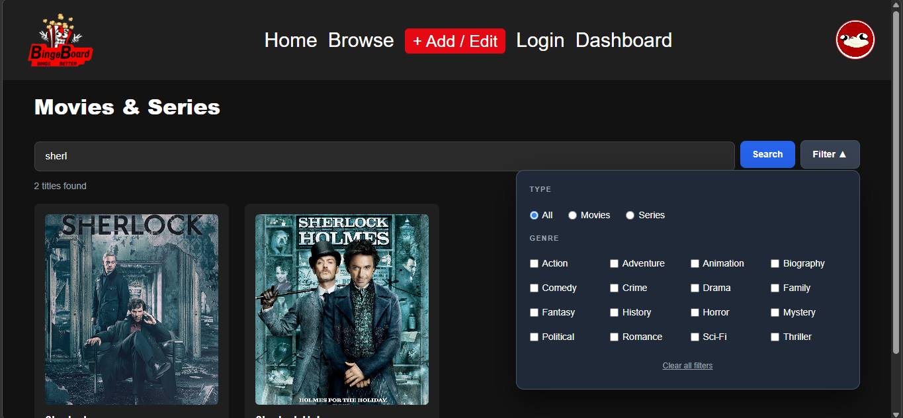
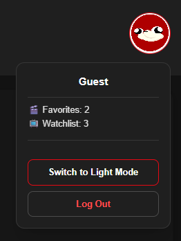
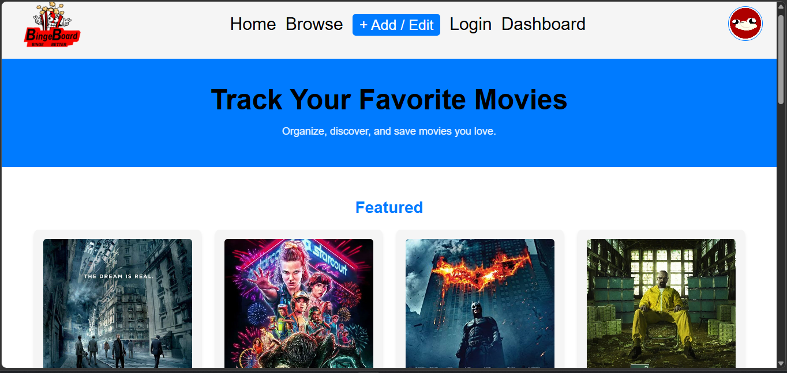
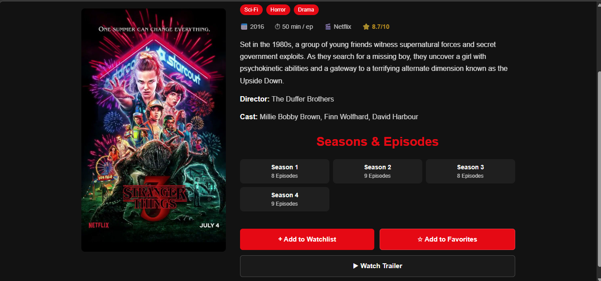
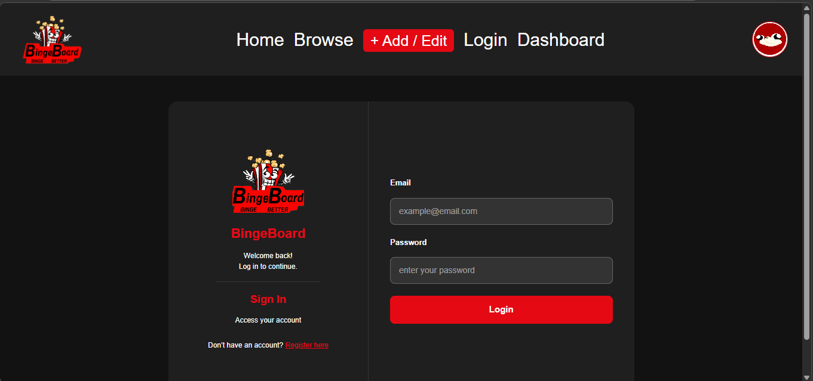
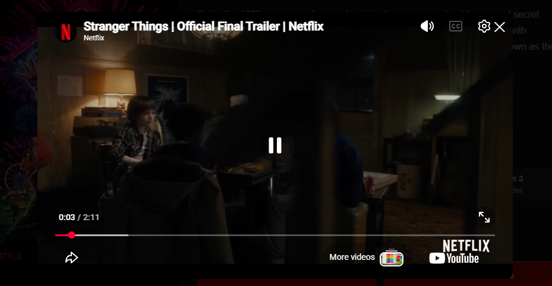
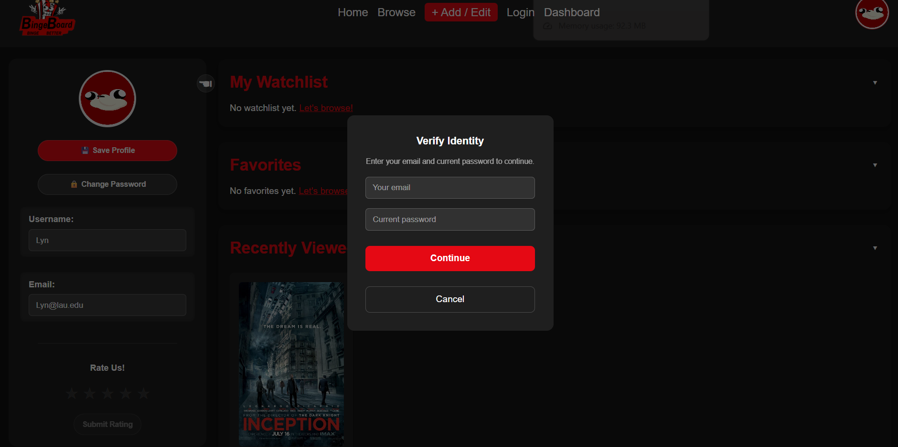

# 🎬 BingeBoard

A movie and TV show tracker web application — browse, search, and manage your watchlist and favorites.

---

## 👥 Team Members

| Name                  | GitHub          |
| --------------------- | --------------- |
| Leen Harfoush         | harfoushleen    |
| Hamza El Hallak       | HamzaElHallak   |
| Garen Garo Baghsarian | GarenBaghsarian |
| Laura Malaeb          | laura1025       |

---

## 📌 Project Topic

**Movie / TV Show Tracker** — A web application where users can browse, search, and manage movies and TV shows.

### Primary Data Entities

- **Movie** — Includes title, genre, year, rating, director, cast, studio, duration, trailer, and description.
- **TV Show (Series)** — Same as Movie, with an additional `seasons` object containing total season count and episodes per season.

---

## 🚀 Live Demo

> _Link to be added after deployment._

---

## ⚙️ Setup Instructions

### Prerequisites

- [Node.js](https://nodejs.org/) (v18 or higher recommended)
- npm (comes with Node.js)

### Steps

```bash
# 1. Clone the repository
git clone https://github.com/Garenb3/Loading.git

# 2. Navigate into the project directory
cd bingeboard

# 3. Install dependencies
npm install

# 4. Start the development server
npm run dev
```

Then open your browser and go to `http://localhost:5173`.

---

## 🗂️ Pages & Views

| Page               | File               | Responsible Member    |
| ------------------ | ------------------ | --------------------- |
| Home               | `Home.jsx`         | Laura Malaeb          |
| Login              | `Login.jsx`        | Laura Malaeb          |
| Register           | `Register.jsx`     | Leen Harfoush         |
| Dashboard          | `Dashboard.jsx`    | Leen Harfoush         |
| Browse (List View) | `ListView.jsx`     | Garen Garo Baghsarian |
| Movie Detail       | `MovieDetail.jsx`  | Garen Garo Baghsarian |
| TV Show Detail     | `TVShowDetail.jsx` | Hamza El Hallak       |
| Add / Edit Form    | `AddEditForm.jsx`  | Hamza El Hallak       |

---

## 🧩 Team Contributions

### Leen Harfoush — `Register.jsx`, `Dashboard.jsx`

**Register Page**

- Designed a two-section registration layout for improved visual organization and user experience.
- Built complete client-side validation: email format, minimum 6-character password, and password confirmation matching.
- On successful registration, user data is saved to `localStorage` and the user is redirected to the dashboard.
- Link to Login page for old users.

**Dashboard Page**

- Developed the main dashboard with three fully functional sections: Watchlist, Favorites, and Recently Viewed.
- All three sections are driven by localStorage, staying in sync with actions taken across the app.
- Implemented collapsible sections with smooth expand/collapse animations and a slide-in/out profile panel.
- Implemented toggle behavior (add/remove) functionality in `MovieDetail.jsx` and `TVShowDetail.jsx` then wired it to stay in sync with the dashboard.
- Implemented guest user restrictions for Favorites and Watchlist actions — when a non-authenticated user attempts to add items, a popup prompts them to join/log in and redirects them to the login page.
- Implemented Recently Viewed tracking — any visited movie or show page is automatically logged and shown on the dashboard.
- Displays a re-direction to browse (ListView.jsx) page if Watchlist, Favorites or Recently Viewed are empty.

**Profile Component (`Profile.jsx`)**

- Built an interactive profile panel supporting profile picture upload with live preview, and username/email editing.
- Profile picture updates reflect across the app in real time, including the Navbar.
- Email changes trigger a password verification modal before saving.
- Password changes follow a two-step flow requiring current credential confirmation.
- Includes a Rate Us feature with an interactive star rating widget.
- Guest access control: non-logged-in users are prompted to sign up before editing their profile.

---

### Hamza El Hallak — `TVShowDetail.jsx`, `AddEditForm.jsx`

**TV Show Detail Page**

- Built a detailed view for each TV show using route parameters to dynamically load the correct data.
- Displays title, description, rating, genres, studio, release year, director, cast, and a seasons breakdown (total seasons + episodes per season).
- Integrated "Add to Watchlist" and "Add to Favorites" buttons.
- Added a working "Watch Trailer" button that opens a YouTube embed in a modal overlay.

**Add / Edit Form Page**

- Built a dynamic, reusable form supporting both adding new items and editing existing ones.
- Full client-side validation on all fields.
- Supports pre-filled inputs when editing an existing item.
- Powered by React state, simulating CRUD operations on the local data structure.
- Redirects users to the appropriate view after submission.

**Website Logo**

- Designed and integrated the BingeBoard logo into the Navbar with homepage navigation on click.

---

### Garen Garo Baghsarian — `ListView.jsx`, `MovieDetail.jsx`

**Browse / List View Page**

- Displays all movies and series from the mock data in a responsive 4-column grid.
- Implemented a **search bar** with word-level matching — searching "umbrella" or "academy" both return "The Umbrella Academy". Triggers on Enter key press or Search button click.
- Implemented a **filter panel** (toggled open/closed) with:
  - Type filter: All / Movies / Series (radio buttons, instant filtering).
  - Genre filter: 16 genre checkboxes in a 4-column grid, filtering items that match any selected genre.
  - "Clear all filters" button to reset the state.
- Live result count updates as filters change.
- Empty state UI shown when no results match.

**Movie Detail Page**

- Displays full movie information: title, type badge, genres, full release date (e.g. "March 24, 1972"), duration, studio, rating (`★ 8.9/10`), description, director, writer, producer, and cast.
- Integrated "Add to Watchlist" and "Add to Favorites" buttons.
- "Watch Trailer" button opens the trailer in a modal overlay using a YouTube embed URL.

---

### Laura Malaeb — `Home.jsx`, `Login.jsx`

**Home Page**

- Landing page showcasing Featured and Trending content sections, dynamically filtered from the dataset.
- "Show More / Show Less" toggle with smooth state transitions and scroll-to-section behavior on collapse.
- Responsive grid layout using Tailwind CSS.

**Login Page**

- Consistent layout and styling matching the Register page.
- Form validation ensuring all required fields are filled.
- Credential verification against `localStorage`-stored user data, with clear error feedback on failure.
- Redirects to the dashboard on successful login.
- Link to Register page for new users.

**Navbar Component (`Navbar.jsx`)**

- Dynamic user profile section with a hover-based dropdown card showing username, favorites count, and watchlist count from `localStorage`.
- Theme toggle (dark/light mode) integrated into the profile dropdown.
- Logout clears all user-related `localStorage` data and redirects to login.

**Movie Card Component (`MovieCard.jsx`)**

- Reusable card component for movies and series with dynamic routing to the correct detail page based on `type`.
- Fallback image handling, hover scale effect, and consistent title/genre display.

---

## 🗃️ Mock Data

All application data is stored in `src/data/Data.js` as a exported JavaScript array of 60 items. Each item contains:

```js
id: (1,
  {
    title: "Inception",
    type: "movie", // movie or series
    genre: ["Sci-Fi", "Action", "Thriller"],
    featured: true,
    trending: true,
    image: "/images/Inception.jpg",
    duration: 148,
    releaseDate: "2010",
    rating: 8.8,
    director: "Christopher Nolan",
    studio: "Warner Bros.",
    cast: [
      "Leonardo DiCaprio",
      "Joseph Gordon-Levitt",
      "Elliot Page",
      "Tom Hardy",
    ],
    description: "...",
    trailer: "https://www.youtube.com/embed/YoHD9XEInc0",
  });
```

Series items additionally include:

```js
seasons: {
  total: 4,
  episodesPerSeason: [8, 9, 8, 9]
}
```

**How mock data simulates backend interactions:**

- **Browsing & Search** — The `ListView` page filters and searches the `data` array entirely in the browser using `useMemo`, with no server calls.
- **Detail pages** — `MovieDetail` and `TVShowDetail` use `useParams` to find the matching item in the array by ID.
- **Watchlist / Favorites / Recently Viewed** — Actions are persisted to `localStorage`, simulating a user account database. Data is read/written on every interaction and reflected across the Dashboard, Navbar, and detail pages.
- **Add / Edit** — The `AddEditForm` updates the local data structure and `localStorage`, simulating CRUD without a real API.
- **Authentication** — User accounts (email, username, password) are stored in `localStorage` on registration and verified on login, simulating a user auth system.

---

## 🖼️ Screenshots

| Feature             | Preview                              |
| ------------------- | ------------------------------------ |
| Home Page           |             |
| Add / Edit          |      |
| Dashboard           |   |
| Filter Panel        |         |
| Light / Dark Mode   |   |
| Light Mode          |           |
| TV Shows            |      |
| User Login          |       |
| Watch Trailer       |  |
| Password validation |        |

---

## 🛠️ Tech Stack

| Technology        | Usage                                                          |
| ----------------- | -------------------------------------------------------------- |
| React (Vite)      | Component-based UI, hooks (`useState`, `useEffect`, `useMemo`) |
| React Router      | Client-side navigation, route parameters                       |
| Tailwind CSS      | Responsive utility-first styling                               |
| JavaScript (ES6+) | Application logic                                              |
| localStorage      | Mock data persistence across sessions                          |
| Git & GitHub      | Version control and collaboration                              |
